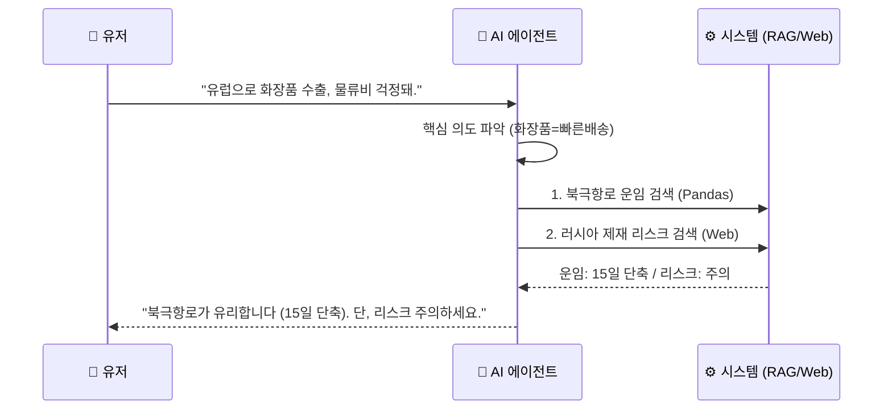

<!-- _class: lead -->
<!-- _backgroundColor: #002b36 -->
<!-- _color: white -->

# 🚢 NSR Smart Navigator
## 북극항로 수출 전략 에이전트

**KOTRA 통상직 직무 지원 포트폴리오**
무역 업무의 디지털 전환(DX)을 위한 AI 솔루션

---

## 1. 기획 배경 (Background)
### **"왜 지금 북극항로인가?"** 🌏

*   **배경**: **수에즈 운하 사태** 등 글로벌 물류 불안정 심화.
*   **문제점**: 중소기업은 정보 부족과 지정학적 리스크로 인해 대체 항로 접근이 어려움.

> **📉 수에즈 운하 사태 (Suez Canal Crisis)**
> 2021년 에버기븐호 좌초 및 최근 홍해 리스크로 **전 세계 물류가 마비**된 사건.
> 기존 항로의 취약성이 드러나자, **대체 항로(북극항로) 확보 필요성**이 폭발적으로 증가함.

---

## 2. 프로젝트 솔루션 (Solution)
### **"AI로 분석하는 최적의 물류 대안"**

*   **해결책**: **Python(Streamlit)** 기반 AI 에이전트가 뉴스, 운임, 품목 데이터를 분석하여 실시간 컨설팅 제공.

> **💡 북극항로 (NSR)란?**
> 북극해를 지나 유럽과 아시아를 잇는 최단 거리 항로.
> (수에즈 운하 대비 **거리 32% 단축**, 운송 시간 **약 10일 절감**)

---

## 3. 타겟 유저 (Target Audience) 🎯

### **Primary User** 🚛
**유럽 수출 중소기업 물류 담당자**
"수에즈 운하는 너무 오래 걸리는데... 10일이나 빠르다는 북극항로는 어떨까?"

### **Secondary User** 👔
**KOTRA 해외무역관 직원**
"기업 상담 때마다 매번 달라지는 운임과 리스크 정보를 즉각 확인하고 싶다."

---

## 4. 핵심 가치 (Value Proposition)

1.  **실시간 데이터 분석**
    *   뉴스, 해빙 농도 등 변동성 데이터를 실시간 반영
2.  **맞춤형 컨설팅**
    *   화물 품목과 목적지에 따른 최적 경로 제안
3.  **무역 업무 효율화 (DX)**
    *   단순 정보 검색은 AI에게, 사람은 고부가가치 의사결정에 집중

---

<!-- header: 'Navigator' -->

## 5. 핵심 기능 I : 북극항로 경제성 진단
**[NSR Cost Calculator]**

*   **기능**: 기존 수에즈 항로 vs 북극항로 비교 분석
    *   운항 거리 (km) & 예상 소요 시간 (Lead Time) & 연료 절감액 비교
*   **Tech**: **Python Pandas** 활용
    *   **Pandas란?**: "파이썬 안의 엑셀". 수만 줄의 운임 데이터를 0.1초 만에 로드하고 계산해주는 강력한 데이터 분석 도구.

---

## 6. 핵심 기능 II : 지정학적 리스크 모니터링
**[Risk Radar]**

*   **기능**: **[안전 / 주의 / 위험]** 신호등 형태의 리스크 브리핑
    *   러시아 제재 뉴스 모니터링
    *   북극 해빙 농도 데이터 분석
*   **Tech**: **LangChain Web Search**
    *   **역할**: AI에게 **"실시간 인터넷 검색"** 능력을 부여하여, 학습하지 않은 최신 뉴스(러시아 제재, 빙하 상황)를 답변에 반영.

---

<!-- header: '' -->

## 7. 핵심 기능 III : 수출 유망 품목 추천
**[Item Matcher]**

*   **기능**: 북극항로(빠른 배송)에 적합한 품목 추천
    *   **HS Code (품목분류코드)** 안내: 상품의 '주민등록번호'. 관세와 규제의 기준.
*   **Tech**: **LLM & RAG (검색 증강 생성)**
    *   **LLM (거대언어모델)**: 사람처럼 말을 이해하는 AI (예: ChatGPT).
    *   **RAG란?**: **"오픈북 테스트"**. AI가 모르는 내부 정보(유망 품목 리스트)를 슬쩍 참고해서 정확하게 답변하는 기술.

---

## 8. 시연 시나리오 (User Flow) 💬

---

## 9. 기대 효과 및 포트폴리오 전략

*   **정량적 효과**: 상담 시간 단축 (3시간 → 3분)
*   **어필 포인트**:
    *   **"실행력"**: 실제로 작동하는 **Streamlit 웹 앱** 구현
    *   **"디지털 역량"**: **Python과 LLM**을 활용한 무역 업무 혁신(DX) 증명
    *   **"직무 적합성"**: KOTRA의 핵심인 **정보 조사 및 기업 지원** 역량 강조

---

<!-- _class: lead -->
# 감사합니다
**Q&A**
